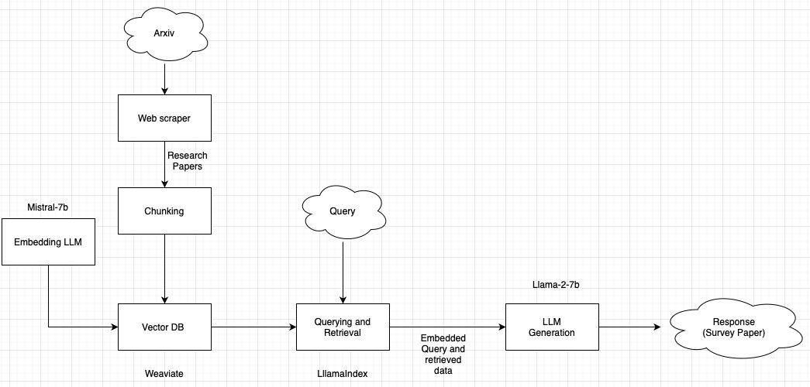

• Developing an automated research survey paper generator for user requested topic employing RAG framework with LlamaIndex using LLama-2-7b for generation and Mistral-7B for vector embedding

• Implementing a web-scraper to ingest research papers and stored them in Weaviate Vector database for retrieval 